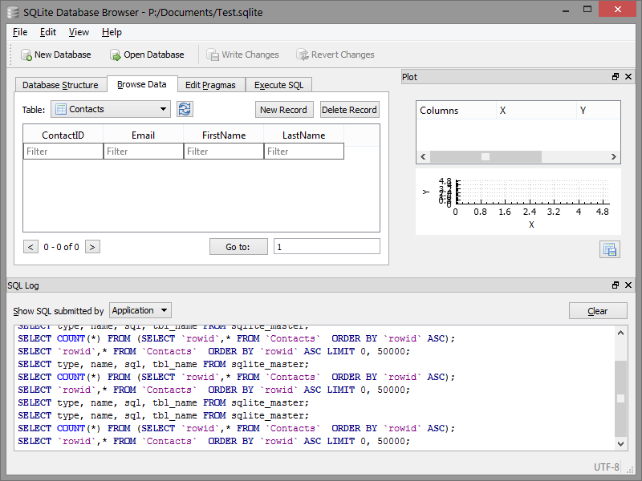

## 1 Electron

#### 1.1 Was ist Electron
Electron ist ein auf Node.js basierendes Open-Source-Framework. Es dient der Entwicklung von grafischen Desktop-Applikationen und ist weitestgehend plattformunabhängig.
#### 1.2 Geschichtliche Entwicklung
Electron hieß früher "Atom Shell" und wurde von GitHub entwickelt.
#### 1.3 Wofür es verwendet wird
Plattformunabhängige Softwarekonzepte mit Augenmerk auf hochwertige Benutzeroberflächengestaltung, finden mit Electron eine passende Schnittstelle zur Umsetzung eines solchen Softwareprojekts.

Renommierte Anwendungen wie "Atom - von Github", "Visual Studio Code - von Microsoft" und "Wordpress - von WordPress Foundation" basieren genau aus diesen Gründen auf dem Electron Framework.
#### 1.4 Auf welchen Technologien es basiert
Electron ist in den Programmiersprachen C++ und JavaScript geschrieben. Es besteht aus den folgenden plattformunabhängigen Komponenten: HTML/CSS, JavaScript/Node.js und Google Chromium
###### 1.4.1 Architekturdiagramm

###### 1.4.2 HTML und CSS
HTML und CSS ermöglichen die präzise, strukturelle und visuelle Definition zum Erscheinungsbild der Applikationen.
###### 1.4.3 JavaScript und NodeJS
Erlauben die Implementierung der Programmlogik und bietet dank dem Node.js Framework eine riesen Bibliothek an bereits fertigen und nützlichen Funktionen.

Des weiteren ist es natürlich auch möglich mit objektorientierten TypeScript Sprachkonzept zu arbeiten, sofern der TypeScript Quellcode letztendlich in JavaScript (eher funktionale Programmierung) umkompilliert wird.
###### 1.4.4 Google Chromium
Ist ein plattformunabhängiger Open-Source-Webbrowser, welcher große Teile seines Quellcodes aus dem Google-Chrome- Webbrowser hat.

Er interpretiert die HTML/CSS und JavaScript/NodeJS Anweisungen der Applikation und gibt diese Ergebnisse an den Anwender aus.

Im Normalfall merkt der Anwender nicht, dass er im prinzip nur einen lokalen offline Chromium-Browser benutzt, da optisch nichts darauf hinweist, wie z.B. eine Adressleiste oder Lesezeichen und so alles wie eine eigene Applikation wirkt.
#### 1.5 Anwendungsgebiete
Da die Anwendungsgebiete wirklich sehr breit gefächert sind, beschränken wir uns in der folgenden Auflistung nur auf ein paar interessante Applikation von +244.
###### 1.5.1 Spiele - 5EClient
Mitglieder des chinesischen "Counter-Strike Global Offensive" Ligaforums 5eplay.com, ist es mit dem 5EClient möglich neuste Spielpartien anzusehen und sich mit anderen Community Mitgliedern auszutauschen.
###### 1.5.2 Editoren - Atom
Ist ein freier und beliebter Texteditor, welcher viele Programmiersprachen im Highlighting unterstützt.
###### 1.5.3 Community Clients - caprine
Ist ein inoffizieller Facebook-Chat-Client.
###### 1.5.4 Hardwarelösungen - Airtame
Anwendern ist es mit einem speziellen HDMI-Wireless-Stick möglich ihren Bildschirminhalt kabellos zu teilen. Dazu wird der Stick in den Grafikkartenausgang des Hosts gesteckt. Nun ist es jedem Benutzer der Airtame Applikation (basiert auf Electron) möglich den Bildschirm des Hosts zu streamen.
###### 1.5.5 Softwareenticklung - Amium
Dient der Dateiverwaltung bei Projekten in größeren Gruppen. Es ermöglicht zum Beispiel mehreren Personen gleichzeitig die Bearbeitung an einer einzigen Worddatei.
###### 1.5.6 Sicherheit - BitCrypt
BitCrypt erlaubt die Verschlüsselung und Entschlüsselung von Datein.
###### 1.5.7 Webbrowser - brave
Ein kostenloser und performanter Webbrowser, welcher sich absolute Anonymisierung als Priorität gesetzt hat.
#### 1.6 Vorraussetzungen zur Ausführung
OS X: ab 10.9

Windows: ab Windows 7

Linux: Ubuntu ab 12.04, Fedora ab 21 und Debian ab 8
#### 1.7 Tools und Libaries zur Entwicklung
#### 1.8 Installation Electron
#### 1.9 API
###### 1.9.1 Main Prozess
###### 1.9.2 Renderer Prozess
###### 1.9.3 Beide Prozesse

## 2 SQLite
#### 1.1 Was ist SQLite
Mit SQLite ist man in der Lage eine kleine relationale Datenbank lokal und Server/Client unabhängig zu verwalten. Sie unterstützt einen Großteil der im SQL-92-Standard festgelegten SQL-Sprachbefehle und ist somit weitestgehend mit MSSQL- und MySQL-Skripten kompatibel. Die angelegte Datenbank liegt als einzelne .db Datei vor und ist binär codiert.
#### 1.2 Anwendungsgebiete
SQLite wird meist in relativ kleinen Umgebungen verwendet. Dort wo kleine und überschaubare Datenmengen anfallen und die sich dann jeweils nur auf die entsprechende Anwendung oder dem entsprechendem Gerät beziehen.

Eingesetzt wird es z.B. in den Betriebssystemen Symbian OS und Android. Als auch im Webbrowser Mozilla Firefox zur Datenverwaltung von Cookies und Lesezeichen.
#### 1.3 Vorraussetzungen zur Ausführung
SQLite hat sehr geringe Leistungsansprüche und ist somit auch ideal für eingebettete Systeme geeigenet.

Speicherplatz: ab 300KiB

Arbeitsspeicher: ab 104KiB (Stack = 4KiB & Heap = 100KiB)
#### 1.4 Tools und Libaries zur Entwicklung
Mit dem kostenlosen SQLite Database Browser ist es möglich .db Datein zu öffnen und zu erstellen. Es ist ebenfalls möglich direkt Skripte zu schreiben und sie auszuführen. Datenmanipulation in bestehenden Datenbankdomänen ist auch gegeben.

## 3 Anhang und Literaturverzeichnis
* [5EClient](https://www.5eplay.com/)
* [Atom](https://atom.io/)
* [Airtame](https://airtame.com/)
* [Amium](https://www.amium.com/)
* [BitCrypt](https://github.com/Nazgul07/BitCrypt)
* [brave](https://brave.com/)
* [Caprine](https://github.com/sindresorhus/caprine)
* [CSS](https://wiki.selfhtml.org/wiki/CSS)
* [Electron](http://electron.atom.io)
* [Google Chromium](https://wiki.ubuntuusers.de/chromium/)
* [HTML](https://wiki.selfhtml.org/wiki/HTML)
* [JavaScript](https://wiki.selfhtml.org/wiki/JavaScript)
