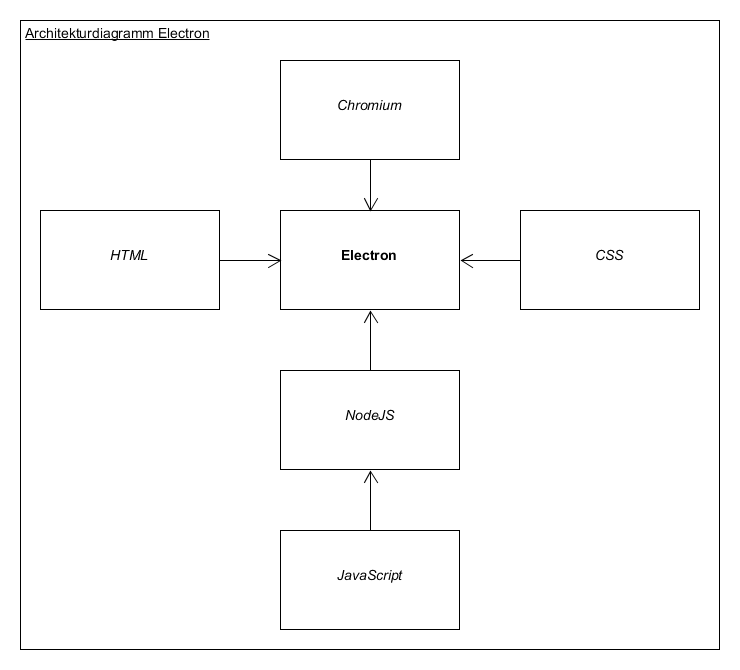

## 1 Electron

#### 1.1 Was ist Electron
#### 1.2 Geschichtliche Entwicklung
#### 1.3 Wofür es verwendet wird
#### 1.4 Auf welchen Technologien es basiert
###### 1.4.1 Architekturdiagramm

###### 1.4.2 Google Chromium
###### 1.4.3 JavaScript und NodeJS
###### 1.4.4 HTML und CSS
#### 1.5 Anwendungsgebiete
#### 1.6 Vorraussetzungen zur Ausführung
#### 1.7 Tools und Libaries zur Entwicklung

Um ein Programm mit Electron zu schreiben kann ein beliebige Entwicklungsumgebung verwendet werden.
Von Vorteil sind jedoch IDE's, die Node.js unterstützen, da Electron auf diese Technologie aufbaut.

Sollte Node.js bereits installiert sein, reicht es aus das Electron Package mit dem `npm` Package Manager runterzuladen.
```
npm install electron
```

#### 1.8 Installation Electron

##### 1.8.1 Struktur
Die Allgemeine Stuktur eines Projeks sieht wie folg aus

```
AppName/
├── package.json
├── main.js
└── index.html
```

##### 1.8.2 package.json
Das Format für die `package.json` ist die gleiche wie bei Node.js.
Eine Beispiel könnte so aussehen.

```json
{
  "name": "electron-quick-start",
  "version": "1.0.0",
  "description": "A minimal Electron application",
  "main": "main.js",
  "scripts": {
    "start": "electron ."
  },
  "repository": "https://github.com/electron/electron-quick-start",
  "keywords": [
    "Electron",
  ],
  "author": "GitHub",
  "license": "CC0-1.0",
  "devDependencies": {
    "electron": "^1.4.1"
  }
}
```
Quelle: https://github.com/electron/electron-quick-start

Die Zeilen `name`, `version` und `description` beschreiben unser Projekt.

Bei `main` hinterlegen wir welches Script unsere Ausgangsdatei ist. Wenn das `main` Feld nicht hinnterlegt ist versucht Electron automatisch `index.js` zu laden.

Mit `start`geben wir an, welcher Kommandobefehl aufgerufen sind, wenn wir unser Projekt mit `npm start` deployen.

Dann haben wir noch die Möglichkeit informationen über die Entwicklung zu hinterlegen, hier können wir angeben, wer am Projekt beteiligt ist, unter welcher Lizenz die Software verwendet wird.

Anschließen geben wir noch mit `dependencies` oder `devDependencies` an, welche Abhängikeiten unser Projekt hat.
Hier wird mit `dev` unterschieden ob es sich nur für die Entwicklungszwecke handelden Abhängikeiten sind oder um Produktionsszwecke.

##### 1.8.2 main.js
Die `main.js` sollte unser Fenster erstellen und Systemevents behandeln.

 ``` javascript
 const electron = require('electron')
 // Module to control application life.
 const app = electron.app
 // Module to create native browser window.
 const BrowserWindow = electron.BrowserWindow

 const path = require('path')
 const url = require('url')

 // Keep a global reference of the window object, if you don't, the window will
 // be closed automatically when the JavaScript object is garbage collected.
 let mainWindow

 function createWindow () {
   // Create the browser window.
   mainWindow = new BrowserWindow({width: 800, height: 600})

   // and load the index.html of the app.
   mainWindow.loadURL(url.format({
     pathname: path.join(__dirname, 'index.html'),
     protocol: 'file:',
     slashes: true
   }))

   // Open the DevTools.
   mainWindow.webContents.openDevTools()

   // Emitted when the window is closed.
   mainWindow.on('closed', function () {
     // Dereference the window object, usually you would store windows
     // in an array if your app supports multi windows, this is the time
     // when you should delete the corresponding element.
     mainWindow = null
   })
 }

 // This method will be called when Electron has finished
 // initialization and is ready to create browser windows.
 // Some APIs can only be used after this event occurs.
 app.on('ready', createWindow)

 // Quit when all windows are closed.
 app.on('window-all-closed', function () {
   // On OS X it is common for applications and their menu bar
   // to stay active until the user quits explicitly with Cmd + Q
   if (process.platform !== 'darwin') {
     app.quit()
   }
 })

 app.on('activate', function () {
   // On OS X it's common to re-create a window in the app when the
   // dock icon is clicked and there are no other windows open.
   if (mainWindow === null) {
     createWindow()
   }
 })

 // In this file you can include the rest of your app's specific main process
 // code. You can also put them in separate files and require them here.
 ```
 Quelle: https://github.com/electron/electron-quick-start

##### 1.8.3 index.html
Schlussendlich brauchen wir noch unsere `index.html`. Die schreiben wir in ganz normalem Html.

```html
<!DOCTYPE html>
<html>
  <head>
    <meta charset="UTF-8">
    <title>Hello World!</title>
  </head>
  <body>
    <h1>Hello World!</h1>
    We are using node <script>document.write(process.versions.node)</script>,
    Chrome <script>document.write(process.versions.chrome)</script>,
    and Electron <script>document.write(process.versions.electron)</script>.
  </body>
</html>
```

##### 1.8.4 App starten
Nachdem wir nun unsere nötigen Datein `main.js`, `index.html` und `package.json` erstellt haben, können wir unser Projekt starten.

#### 1.9 API
###### 1.9.1 Main Prozess
In Electron, wird der Prozess, der die `package.json` ausführt und somit auch die `main.js` Main Prozess genannt. Das Script, dass im Main Prozess läuft, zeigt eine GUI mit hilfe von den erstellten Webseiten an.

###### 1.9.2 Renderer Prozess
Um die erstellen Seiten darzustellen, greift Electron auf Chromium und seine Multi-Prozess Architecture zu.
Jede Seite läuft in einem eigenen Prozess, welches auch als Renderer Prozess bezeichnet wird.

Normalerweise wird Browsers verwehrt auf Native Resourcen zuzugreifen. Mit Electron jedoch, haben wir mit der Hilfe von Node.js Api die mögichkeit mit diesen Nativen Resourcen zu interagieren.

###### 1.9.3 Beide Prozesse
Der Hauptprozess erstellt eine Seite mit Hilfe von einer `BrowserWindow`Instanz. Jede `BrowserWindow` Instanz läuft in Ihrem eigenen Render Prozess. Wenn eine Instanz zersört wurde, dann wird der zuständie Render Prozess ebenfalls zerstört.

Der Hauptprozess verwaltet alle Seiten und deren zuständien Renderer Prozesse. Jeder Render Prozess ist für sich isoliert und kümmert sich nur um eine Seite.

Wenn eine Seite über die GUI auf Native Elemente zugreifen will, dann wird es nicht direkt über die Seite gemacht, das wäre zu gefährlich und könnte zu Lecks führen. Daher muss der Render Prozess einer Seite erst mit dem Hauptprozess kommunizieren um die Nativen Operationen ausführen zu können.

In Electron haben wir mehrere Wege um eine Kommunikation zwischen Render Prozess und dem Hauptprozess erzustellen.
Z. B. `ipcRenderer`um Asynchron vom Render Prozess mit dem Hauptprozess zu kommunizeren.

//TODO ipcRenderer beschreiben

## 2 SQLite
#### 1.1 Was ist SQLite
#### 1.2 Anwendungsgebiete
#### 1.3 Vorraussetzungen zur Ausführung
#### 1.4 Tools und Libaries zur Entwicklung

## 3 Anhang und Literaturverzeichnis
