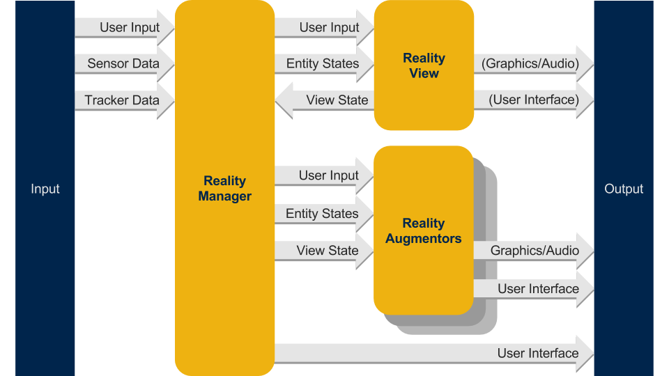

Javascript Framework um Augmented Reality Inhalte in Webanwendungen darzustellen

## Was ist ArgonJS?
ArgonJS ist ein Javascript Framework für die Entwicklung von Augmented Reality (AR) Webanwendungen des AR Schwerpunkts des Georgia Institute of Technology. Dabei können mit Standard Webtechnologien (HTML, CSS3, JavaScript, WebGL, usw.), AR Anwendungen erstellt werden, die 3D Grafiken auf dem Kamerabild rendern, es können geodatengestützt Ereignisse ausgelöst werden und durch Nutzung des Vuforia SDKs optische Mustererkennung in der Anwendung benutzt werden um zum Beispiel 3D Modelle auf eine vorher definierte Fläche zu legen. Das Design des Frameworks soll in Zukunft die Nutzung in allen standardkonformen Browsern gestatten, im Moment ist die Nutzung nur unter iOS mit dem zur Verfügung gestellten Argon Browser praktikabel, eine Android Version ist in Arbeit.

## Kernkonzepte

Die Entwickler des ArgonJS Frameworks gehen davon aus das (mobile) Browser in Zukunft reichthaltige Möglichkeiten bieten werden mit Augmented Reality Inhalten umzugehen, sodass beliebig der eigene Kamerafeed, ein anderer Kamerafeed oder z.B. die Vogelperspektive des aktuellen Standortes mit AR Inhalten angereichert werden kann. So sollen auch mehrere Kamerafeeds oder mehrere gleichzeitige AR Anwendungen unterstützt werden und das Framework besitzt einige Abstraktionsschichten um mit der noch nicht vorhandenen Unterstützung umzugehen: 

Es gibt 3 Kernabstaktionsschichten im ArgonJS Framework:

* **Reality Augmentor** - Bild der Realität erweitern
* **Reality View** - Realität darstellen
* **Reality Manager** - verwaltet die Erweiterung der Reality View mit ein oder mehreren Reality Augmentors

In früheren AR Anwendungen wurden diese 3 Zuständigkeiten nicht klar voneinander getrennt, dieser "Seperation of Concerns" Ansatz sorgt aber für eine gute Austauschbarkeit der verschiedenen Module.

## weitere Bestandteile

* **cesium.js** - Cesium Entitäten beschreiben Platzierung von 3D Objekten auf der Erde
* **three.js** - Javascript 3D Bibliothek
