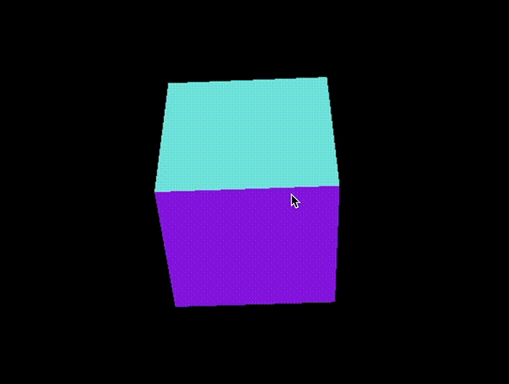

# Was ist Three.js?
Three.js ist eine objektorientierte JavaScript-Bibliothek für 3D-Grafiken, welches von [Mr.doob](https://github.com/mrdoob) erstellt wurde. Die Bibliothek basiert auf WebGL. Mit Hilfe dieser Bibliothek können 3D-Modelle einfacher dargestellt werden, als mit reinem WebGL.

Three.js nutzt diverse Konzepte der Computergrafik. Darunter zählen 3D-Objekte, Szenen, Transformationen, Lichtquellen, Material- und Textureigenschaften eines Objektes und Kamera.

# Was ist WebGL?
WebGL ist eine Variante des OpenGL, welche speziell für den Webbrowser entwickelt wurde. Ähnlich wie in OpenGL werden also Objekte mit Hilfe von Dreiecken abgebildet.

In WebGL und in der Computergrafik werden Objekte abgebildet, indem ihre Eckpunkte (in der 3D-Welt wird von Vertex (Singular) oder Vertices (Plural) gesprochen) der Szene hinzugefügt werden. So werden für das Abbilden eines Dreieckes drei Vertices benötigt. Aus diesen Vertices wird dann ein sogenanntes Face erstellt.

Three.js bietet die grundlegenden geometrischen Figuren wie Würfel, Kegel oder Kugeln von Haus aus an.

# Hello World!
In der 3D-Welt bildet das *Hello World!* einen Würfel ab. In diesem Kapitel wird dieser Würfel um das Rotieren erweitert.

## Grundsätzlicher Ablauf zur Erstellung einer Szene
Um überhaupt ein Objekt anzuzeigen, sind mindestens eine Szene, eine Kamera und ein Renderer notwendig.<br>
In Three.js existiert ein genereller Ablauf zur Generierung einer Szene. Der Ablauf setzt sich zusammen aus dem Erstellen der Szene, dem Rendern der Szene und evtl. dem Animieren der Objekte.

## Vorbereitung
Zum Erstellen einer Szene reicht es, eine *HTML*-Datei mit folgendem Inhalt zu erstellen:

```HTML
<!DOCTYPE html>
<html>
  <head>
    <script src="lib/three.js"></script>
  </head>
  <body>
    <script src="./cube.js"></script>
  </body>
</html>
```
Dabei werden die Bibliothek [*three.js*](https://cdnjs.cloudflare.com/ajax/libs/three.js/r83/three.min.js) und ein weiteres Skript zur Generierung einer Szene, hier ein rotierender Würfel, in die *HTML*-Datei eingebunden.

## Erstellen einer Szene
Eine Szene dient der Repräsentation eines Objektes in der 3D-Welt und beinhaltet Informationen zu der Lichtquelle, den Objekten und der Kamera. Die Szene wird aus der Perspektive der Kamera betrachtet, welche dazu beiträgt, das Erstellen einer Grafik der 3D-Welt durch den Renderer zu ermöglichen.

Der folgende Quellcode zeigt, wie eine Szene und eine Kamera erstellt werden.

```Javascript
// Definieren der Szene und der Kamera als globale Variablen
var scene, camera;

init();

// Initialisieren der Szene.
function init() {

  // Erstellen der Szene
  scene = new THREE.Scene();

  // Festlegen der Größe der Szene
  var width = window.innerWidth;
  var height = window.innerHeight;

  // Erstellen der Kamera
  camera = new THREE.PerspectiveCamera(45, width / height, 0.1, 20000);

  // Position der Kamera festlegen
  camera.position.set(0,0,500);

  // Kamera der Szene hinzufügen
  scene.add(camera);

  // Erstellt einen Würfel, Erklärung in den nächsten Schritten
  createCube();

  // Sorgt für die Animation, Erklärung in den nächsten Schritten
  animate();

}
```

## Erstellen des Renderers
Der Renderer ist dafür verantwortlich, das Bild der 3D-Welt zu erstellen und an das *HTML*-Tag <*canvas*> zu übertragen, welches letztendlich das Bild der 3D-Welt erzeugt.

```Javascript
// Definieren des Renderers als globale Variable
var renderer;

// Initialisieren der Szene..
function init() {

  // Code aus dem vorherigen Schritt zur Übersichtlichkeit entfernt

  // Erstellen des Renderers
  renderer = new THREE.WebGLRenderer();

  // Festlegen der Größe des Bildes in der Szene
  renderer.setSize(width, height);

  // Renderer wird dem DOM hinzugefügt
  document.body.appendChild(renderer.domElement);

}
```

## Erstellen von Animationen
Zum Erstellen einer Animation ist zunächst ein Objekt erforderlich, welches als globale Variable definiert wird, da auf diese bei dem Animation zugegriffen wird.

```Javascript
//Definieren eines Würfels als globale Variable
var cube;

// Erstellen eines Würfels
function createCube() {

  // Festlegen der Größe des Würfels
  var cubeGeometry = new THREE.CubeGeometry(100, 100, 100);

  // Festlegen der Materialeigenschaften des Würfels
  var cubeMaterial = new THREE.MeshNormalMaterial();

  // Erzeugen des Mesh des Würfel aus Kombination der Geometriedaten und der Materialeigenschaften
  cube = new THREE.Mesh(cubeGeometry, cubeMaterial);

  // Hinzufügen des Würfels in die Szene
  scene.add(cube);

}
```
Damit der Würfel schon beim Initialisieren der Szene erzeugt wird, wird die Funktion *createCube()* in der *init*-Funktion aufgerufen.

```Javascript
function animate() {

    // Erzeugt einen Loop, in dem die Funktion animate() wiederholt aufgerufen wird
    requestAnimationFrame(animate);

    //Rotation des Würfels um die x- und y-Achse festlegen
    cube.rotation.x += 0.01;
    cube.rotation.y += 0.02;

    // Rendert den aktuellen Zustand der Szene
    renderer.render(scene, camera);
}
```
Auch die Funktion *animate()* wird in der *init()*-Funktion aufgerufen und sorgt dafür, dass sich der Würfel um seine x- und y-Achse dreht.

Wenn dieses Skript ausgeführt wird, wird ein sich rotierender Würfel auf schwarzen Hintergrund angezeigt, wie der folgenden Abbildung zu entnehmen ist.


